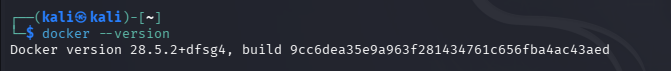
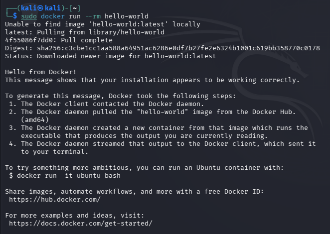
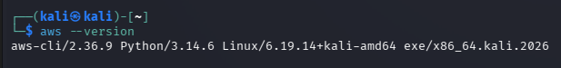
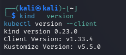
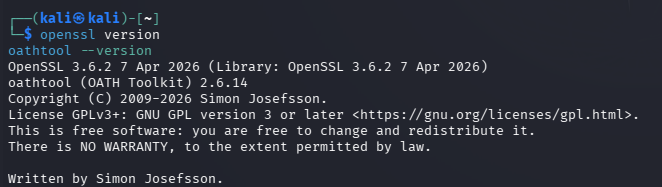
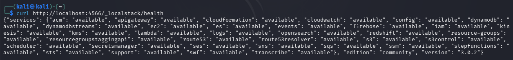
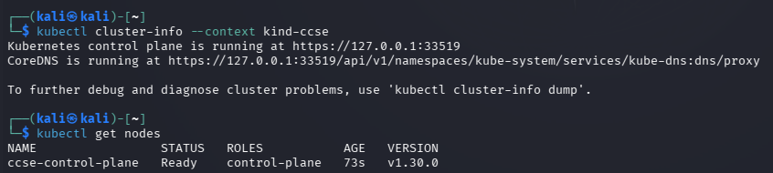
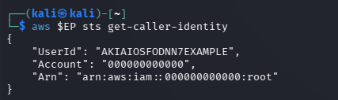

# Lab 0 - Environment Setup Report

## 1. Lab objective

This lab establishes a repeatable local environment for cloud-native development and security exercises. The objective is to confirm that containers, a local AWS emulator, a Kubernetes cluster, command-line administration tools, and cryptographic utilities are installed and can communicate correctly.

The completed environment consists of Docker, AWS CLI, OpenSSL and oathtool, LocalStack, and Kubernetes using kind and kubectl.

## 2. Learning outcomes

After completing this lab, the learner should be able to:

1. Verify that Docker is installed and can run containers.
2. Identify the versions of the AWS CLI, Kubernetes tools, and cryptographic utilities installed on a Linux host.
3. Confirm that LocalStack is running and exposing AWS-compatible services locally.
4. Check Kubernetes control-plane connectivity and node readiness.
5. Use the AWS CLI against a local endpoint instead of an external AWS account.
6. Record commands, outputs, and screenshots as reproducible technical evidence.

## 3. Environment and evidence

All commands were executed in a Kali Linux terminal. The evidence folder contains the screenshots cited below.

| Component | Confirmed version / state | Evidence |
| --- | --- | --- |
| Docker | Docker `28.5.2`; test container completed | `1.png`, `2.png` |
| AWS CLI | AWS CLI `2.36.9` | `3.png` |
| kind and kubectl | kind `0.23.0`; kubectl `v1.33.4` | `4.png` |
| OpenSSL and oathtool | OpenSSL `3.6.2`; oathtool `2.6.14` | `5.png` |
| LocalStack | Community `3.0.2`; services available | `6.png` |
| Kubernetes cluster | `ccse-control-plane` Ready | `7.png` |
| Local AWS identity | Account `000000000000` returned | `8.png` |

## 4. Procedure, commands, results, and evidence

### Step 1 - Check Docker installation

**Used command**

```bash
docker --version
```

**Result:** Docker version `28.5.2` was returned. This confirms that the Docker client is installed.



### Step 2 - Verify that Docker can run a container

**Used command**

```bash
sudo docker run hello-world
```

**Result:** Docker downloaded the `hello-world` image, created a container, ran it, and printed `Hello from Docker!`. This confirms that the Docker daemon is available and can pull and execute an image.



### Step 3 - Check AWS CLI installation

**Used command**

```bash
aws --version
```

**Result:** The terminal reported `aws-cli/2.36.9` with Python `3.14.6` on Kali Linux. The AWS CLI is ready for later local AWS service commands.



### Step 4 - Check Kubernetes tools

**Used commands**

```bash
kind --version
kubectl version --client
```

**Result:** kind version `0.23.0` and kubectl client version `v1.33.4` were returned. These tools can create and administer the local Kubernetes cluster.



### Step 5 - Check OpenSSL and oathtool

**Used commands**

```bash
openssl version
oathtool --version
```

**Result:** OpenSSL `3.6.2` and oathtool `2.6.14` were available. These utilities support the cryptographic and one-time-password tasks used in later security work.



### Step 6 - Check LocalStack health

**Used command**

```bash
curl http://localhost:4566/_localstack/health
```

**Result:** LocalStack returned a health JSON response. The response shows that services including IAM, S3, Lambda, DynamoDB, CloudWatch, SQS, SNS, STS, and others were `available`. The instance is LocalStack Community version `3.0.2`.



### Step 7 - Check the Kubernetes cluster and node

**Used commands**

```bash
kubectl cluster-info --context kind-ccse
kubectl get nodes
```

**Result:** The Kubernetes control plane and CoreDNS were reachable. The node `ccse-control-plane` had status `Ready`, role `control-plane`, and Kubernetes version `v1.30.0`. The local cluster is operational.



### Step 8 - Verify AWS CLI access through LocalStack

**Used command**

```bash
aws $EP sts get-caller-identity
```

`$EP` was configured in the shell to direct the AWS CLI to the LocalStack endpoint. An equivalent explicit form is:

```bash
aws --endpoint-url=http://localhost:4566 sts get-caller-identity
```

**Result:** The command returned the LocalStack test identity, including account `000000000000` and root ARN `arn:aws:iam::000000000000:root`. This proves that the AWS CLI request reached LocalStack successfully rather than a live AWS account.



## 5. Overall result

Every validation step passed. Docker can run images, the required command-line tools are installed, LocalStack is healthy, the `kind-ccse` Kubernetes cluster has a ready control-plane node, and the AWS CLI can successfully call LocalStack STS. The Lab 0 environment is ready for subsequent exercises.

## 6. Lessons learned

1. Installation alone is not enough; an end-to-end test such as `docker run hello-world` proves that the Docker client and daemon work together.
2. Version commands provide a quick baseline for troubleshooting and ensure that all members of a lab group can compare their environments.
3. LocalStack makes it possible to practise AWS CLI workflows locally, reducing the risk and cost of using a real cloud account during development.
4. `kubectl cluster-info` tests control-plane connectivity, while `kubectl get nodes` confirms whether the cluster node is healthy; both checks are needed.
5. Capturing command output as screenshots creates an auditable record and makes it easier to reproduce or diagnose the environment later.

## 7. References

1. IKB42603 Lab 0 Environment Setup Cheatsheet, `IKB42603_Lab0_Environment_Setup_Cheatsheet.pdf`, supplied with this lab.
2. Docker Docs, *Get Started*: https://docs.docker.com/get-started/
3. AWS CLI User Guide: https://docs.aws.amazon.com/cli/
4. LocalStack Documentation: https://docs.localstack.cloud/
5. Kubernetes Documentation: https://kubernetes.io/docs/
6. kind Documentation: https://kind.sigs.k8s.io/

